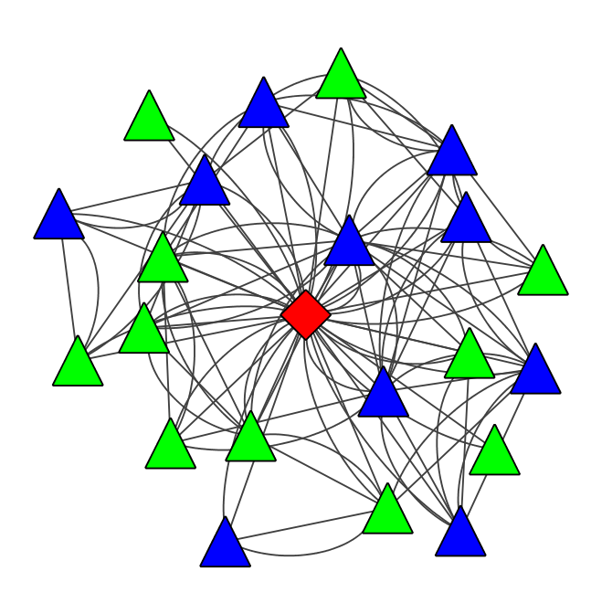

# CWRU Chopper Algorithm

Efficient Processing of Network Proximity Queries Filtering within Top-K -Query- Result via Cytoscape  
Paper: http://www.kdd.org/kdd2016/papers/files/rpp0347-coskunA.pdf  
Case Western Reserve University, Cleveland, OH.  
 
**Update**: In addition to Q-Node and its Top-K result, direct neighbours of Q-Node can be visualized.  
Despite the old version, Q-Node will be coloured with Red and Diamond shape.  
Top-K nodes will be coloured with Blue and Direct-Neighbours will be coloured with Green both in a Triangular shape.  

